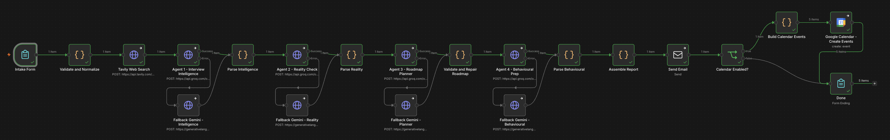
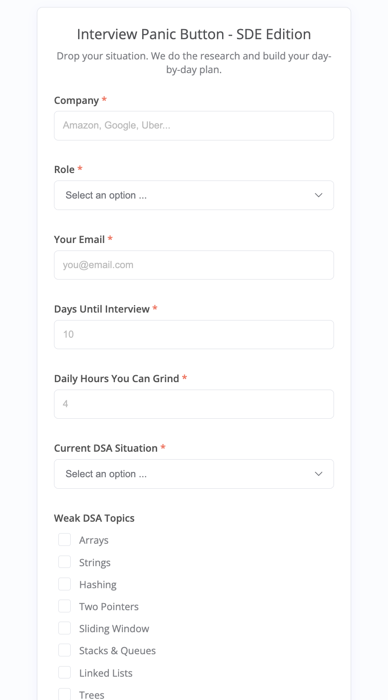
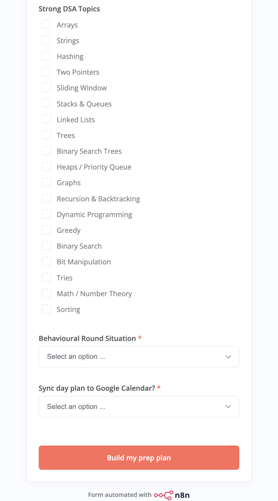
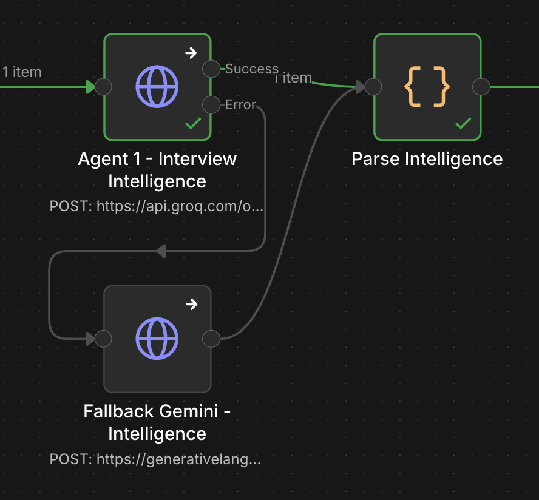
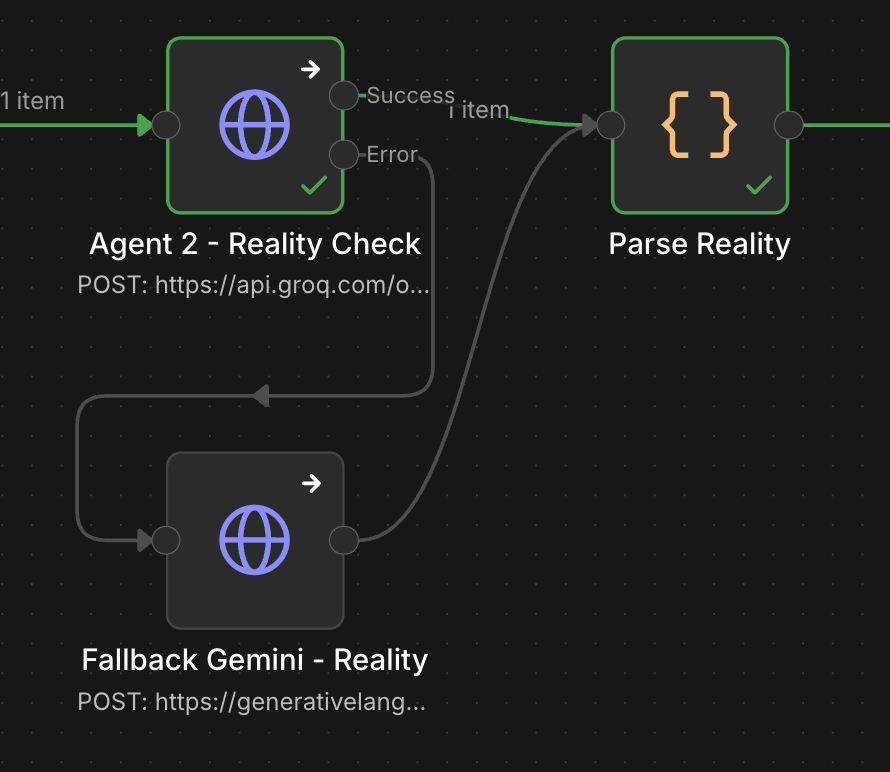
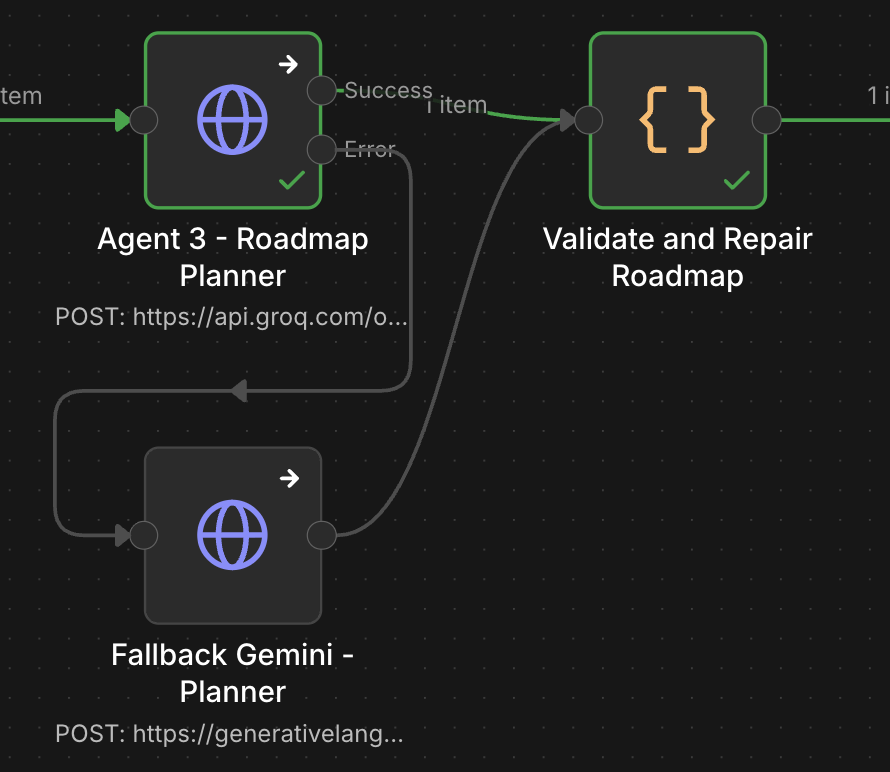
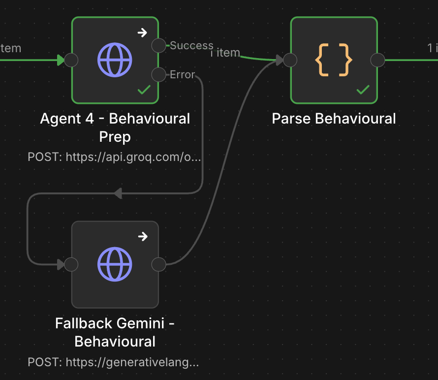

# Workflow Explanation (Node by Node)

## Overall Architecture

The workflow follows an **Agentic Architecture** where multiple AI agents solve a specific task while deterministic code ensures reliability.

---

## 1. Intake Form — **Input**

Collects all required information from the user.

### Captures
- Company
- Role
- Email
- Days Left
- Daily Hours
- DSA Readiness
- Weak / Strong Topics
- Behavioural Readiness
- Calendar Preference

### Screenshots

| Form Part 1 | Form Part 2 |
|-------------|-------------|
|  |  |

## 2. Validate & Normalize — **Control**

Deterministic code validates and standardizes user input.

### Responsibilities
- Safe defaults
- Days/hour limits
- Readiness scoring
- Intensity detection
  - Crisis
  - Sprint
  - Marathon
- Planning directive generation

### Why?
AI decides strategy, code guarantees correctness.

## 3. Tavily Search — **Research**

External web search gathers recent interview experiences.

### Sources
- Leetcode
- GFG
- Medium
- Reddit
- Glassdoor

### Purpose
Avoid relying only on LLM memory.

## 4. Agent 1 — Interview Intelligence — **Analysis**

Researches company-specific interview patterns.

### Generates
- Interview process
- Common DSA topics
- Frequently repeated patterns
- Company-specific interview signals

### Reliability
Groq → Gemini fallback.

## 5. Agent 2 — Reality Check — **Diagnosis**

Provides a brutally honest assessment.

### Generates
- Current readiness
- High ROI topics
- Safe-to-skip topics
- Personalized recommendations

### Goal
Prevent over-preparation and random studying.

## 6. Agent 3 — Roadmap Planner — **Planning**

Creates the personalized preparation roadmap.

### Generates
- Day-by-day roadmap
- Topic priority
- Time allocation
- Revision strategy

### Deterministic Repair
Code enforces:
- Exact number of days
- Hour limits
- Valid structure

### Why?
AI creates plans. Code fixes unrealistic output.

## 7. Agent 4 — Behavioural Prep — **Coaching**

Generates company-specific behavioural preparation.

### Generates
- HR questions
- STAR framework guidance
- Company values
- Behavioural practice prompts

Example:
Amazon → Leadership Principles

## 8. Assemble Report — **Composition**

Deterministic code combines all agent outputs into a clean HTML report.

### Includes
1. Interview Intelligence
2. Reality Check
3. Personalized Strategy
4. High ROI Topics
5. Curated Problem Set
6. Day-by-Day Roadmap
7. Behavioural Prep
8. Motivation

## 9. Send Email — **Delivery**

The final report is emailed to the user.

### Why Email?
- Easy access
- Better readability
- Useful during preparation

## 10. Calendar Branch — **Automation**

Optional branch based on user preference.

### If Enabled
- Creates one prep event per day
- Adds events to Google Calendar

### If Disabled
Workflow completes normally.

---

## 11. Done — **Completion**

Confirms successful workflow execution.